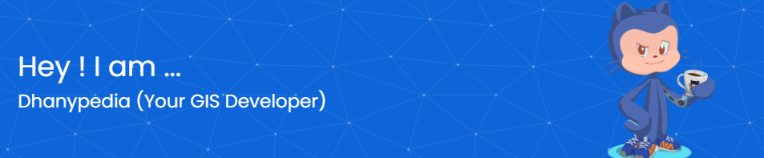

## Hi there Guys 👋

## 🌐 Socials:

# 💻 Tech Stack:
               
# 📊 GitHub Stats:
 
 

### ✍️ Random Dev Quote

### 🔝 Top Contributed Repo

<!-- Proudly created with GPRM ( https://gprm.itsvg.in ) -->
