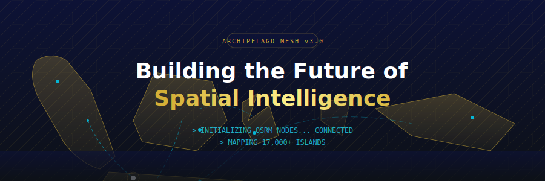
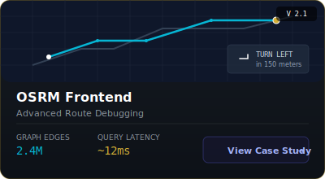
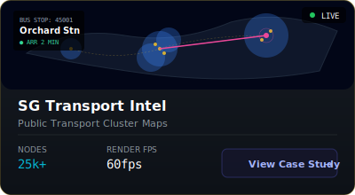
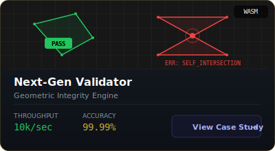
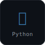
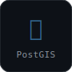
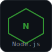
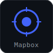
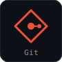
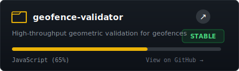

**GIS Developer** specializing in geospatial analysis, web mapping, and high-performance GIS backend services.

---

<h2 align="center">Geospatial Project Gallery</h2>

  
  
  

---

<h2 align="center">Tech Stack</h2>

  
  
  
  
  
  
  
  

---

<h2 align="center">Active Deployments</h2>

  
  

---

<h2 align="center">Contribution Insights</h2>

  
  

  

---

  

