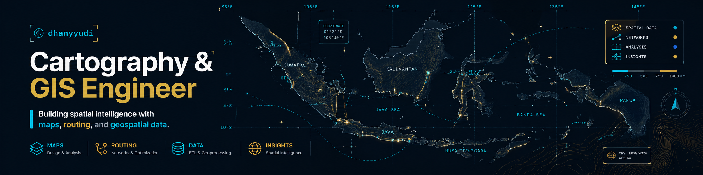
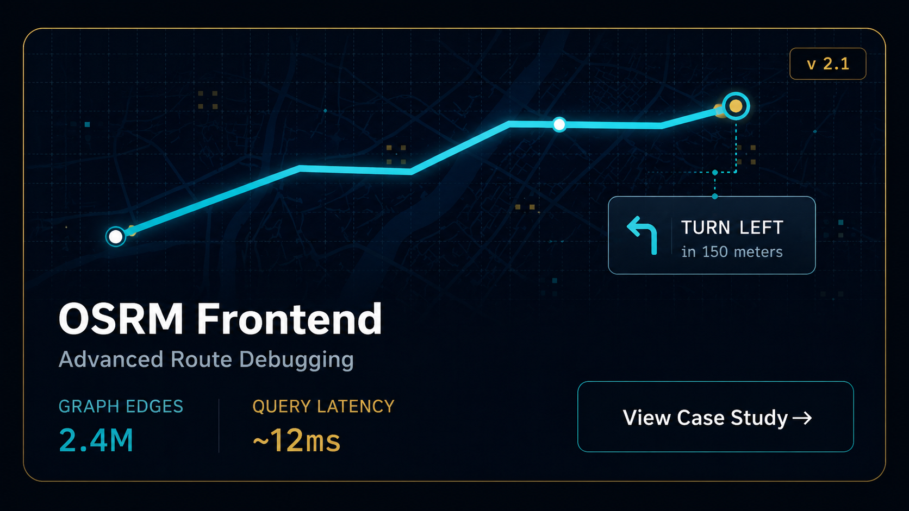
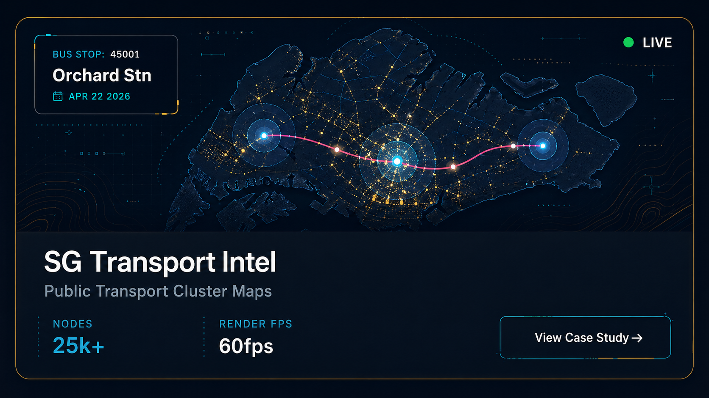
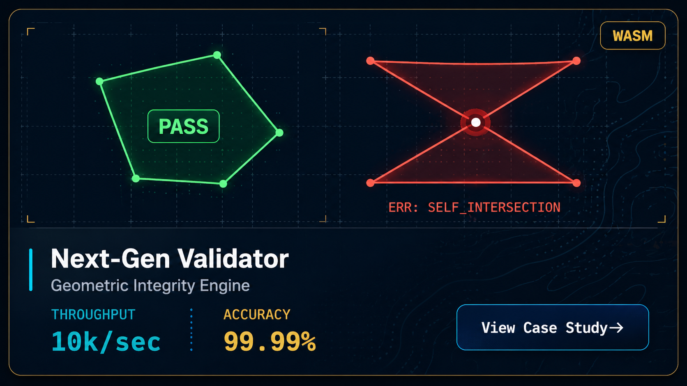

<div align="center">



<br/>

<a href="https://linkedin.com/in/dhanyyudi">
  
</a>
<a href="https://www.giswaypoint.my.id/">
  
</a>


</div>

<br/>

## About

I build geospatial systems that turn maps, routing, and spatial data into production-ready tools.

My work sits around GIS backend services, web mapping, route analysis, geofence validation, spatial ETL, and map-first product interfaces.

```txt
Focus      : GIS engineering, spatial intelligence, routing, validation
Backend    : Python, Node.js, PostGIS, Docker, cloud services
Frontend   : JavaScript, MapLibre GL, interactive geospatial UI
Data       : ETL, geocoding, topology checks, transport and building datasets
```

<br/>

## Selected Work

<table>
  <tr>
    <td width="33%" valign="top">
      <a href="https://myosrm.vercel.app/">
        
      </a>
      <h3>OSRM Frontend</h3>
      <p>Advanced route debugging interface for graph edges, turn-by-turn steps, and routing engine behavior.</p>
      <a href="https://myosrm.vercel.app/">Open demo</a>
    </td>
    <td width="33%" valign="top">
      <a href="https://www.giswaypoint.my.id/">
        
      </a>
      <h3>SG Transport Intel</h3>
      <p>Public transport cluster maps and spatial exploration workflows for Singapore mobility data.</p>
      <a href="https://www.giswaypoint.my.id/">Open site</a>
    </td>
    <td width="33%" valign="top">
      <a href="https://geofence-validator.vercel.app/">
        
      </a>
      <h3>Geofence Validator</h3>
      <p>Geometry validation tool for polygons, self-intersections, topology checks, and geofence QA.</p>
      <a href="https://geofence-validator.vercel.app/">Open demo</a>
    </td>
  </tr>
</table>

<br/>

## Core Stack

<div align="center">
  
</div>

<br/>

## What I Care About

<table>
  <tr>
    <td width="25%"><b>Spatial correctness</b><br/>Topology, coordinate systems, validation, and reproducible data checks.</td>
    <td width="25%"><b>Fast map UX</b><br/>Interactive layers, readable cartography, and responsive geospatial interfaces.</td>
    <td width="25%"><b>Routing systems</b><br/>OSRM-style debugging, network analysis, distance, duration, and route metadata.</td>
    <td width="25%"><b>Production data</b><br/>ETL pipelines, deployment hygiene, observability, and pragmatic automation.</td>
  </tr>
</table>

<br/>

<div align="center">
  
</div>

<br/>

## GitHub Signal

<div align="center">
  
  
</div>

<div align="center">
  
</div>

<br/>

<div align="center">

`maps` `routing` `postgis` `maplibre` `geospatial-data` `spatial-etl` `gis-backend`

</div>
